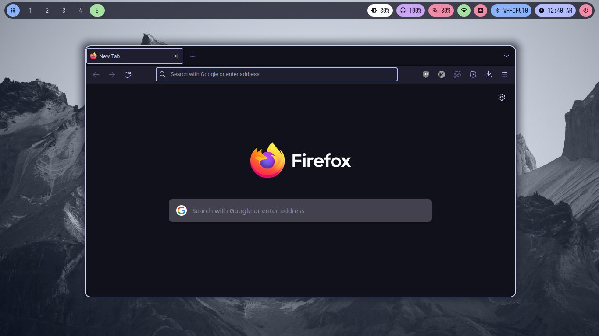
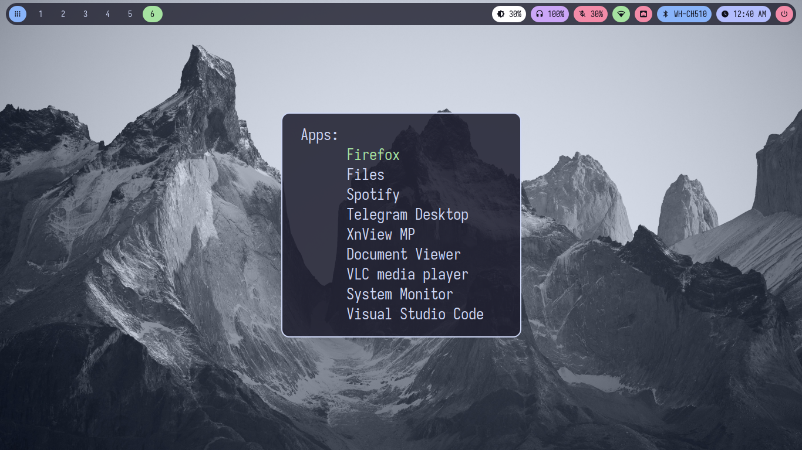
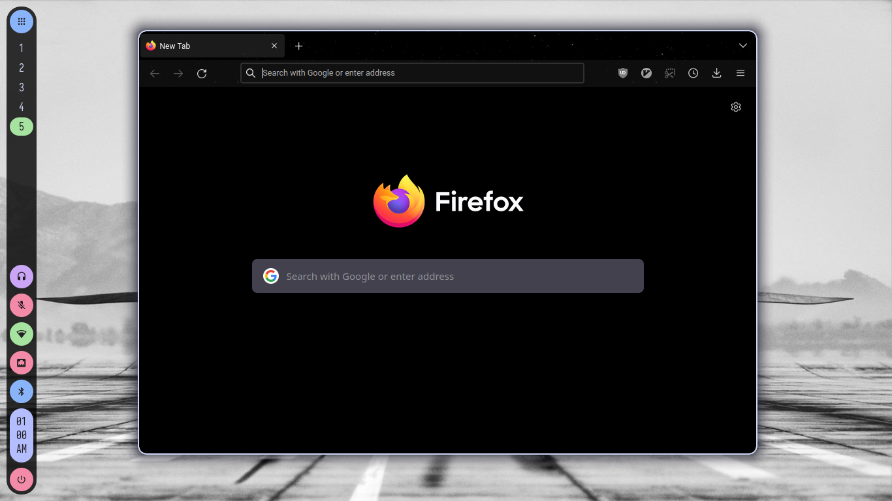
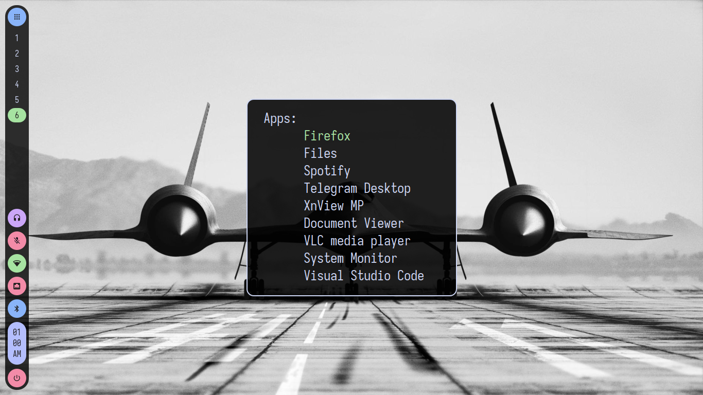

# Dotfiles

## Catppuccin Mocha

### Horizontal Waybar

### Neofetch & cbonsai

### Neovim, <a href="https://github.com/gmr458/nvim" target="_blank">config here</a>

### Dunst

### Firefox theme: <a href="https://github.com/catppuccin/firefox" target="_blank">Catppuccin Mocha Lavender</a>

### Tofi

## Catppuccin Mocha with background black

### Vertical Waybar

### Firefox theme: <a href="https://github.com/nicoth-in/Dark-Space-Theme" target="_blank">Dark Space</a>

## The color scheme used is <a href="https://github.com/catppuccin/catppuccin" target="_blank">Catppuccin</a>

## Programs used in the screenshots:
- <a href="https://github.com/alacritty/alacritty" target="_blank">Alacritty</a>
- <a href="https://gitlab.com/jallbrit/cbonsai" target="_blank">cbonsai</a>
- <a href="https://github.com/dunst-project/dunst" target="_blank">Dunst</a>
- <a href="https://github.com/hyprwm/Hyprland" target="_blank">Hyprland</a>
- <a href="https://github.com/dylanaraps/neofetch" target="_blank">Neofetch</a>
- <a href="https://github.com/neovim/neovim" target="_blank">Neovim</a>
- <a href="https://github.com/romkatv/powerlevel10k" target="_blank">Powerlevel10k</a>
- <a href="https://github.com/philj56/tofi" target="_blank">Tofi</a>
- <a href="https://github.com/Alexays/Waybar" target="_blank">Waybar</a>